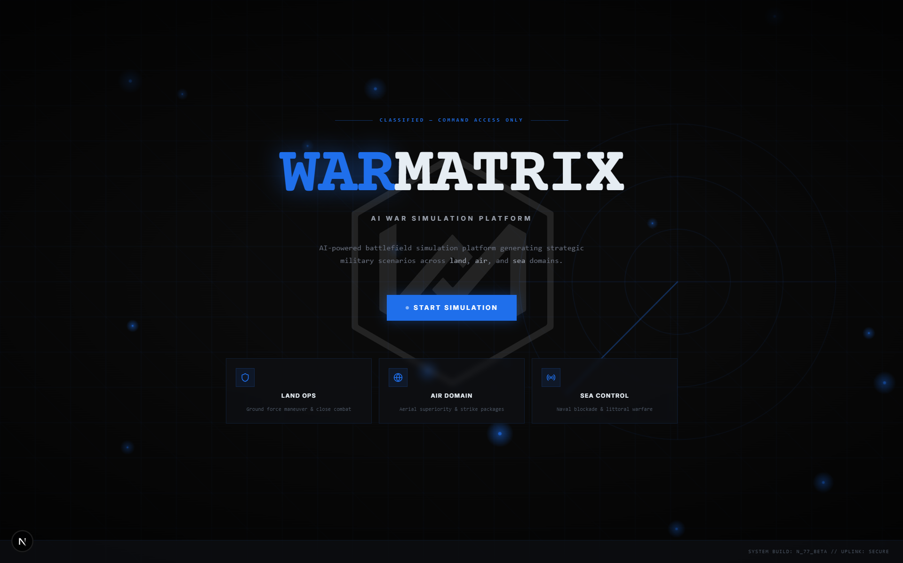
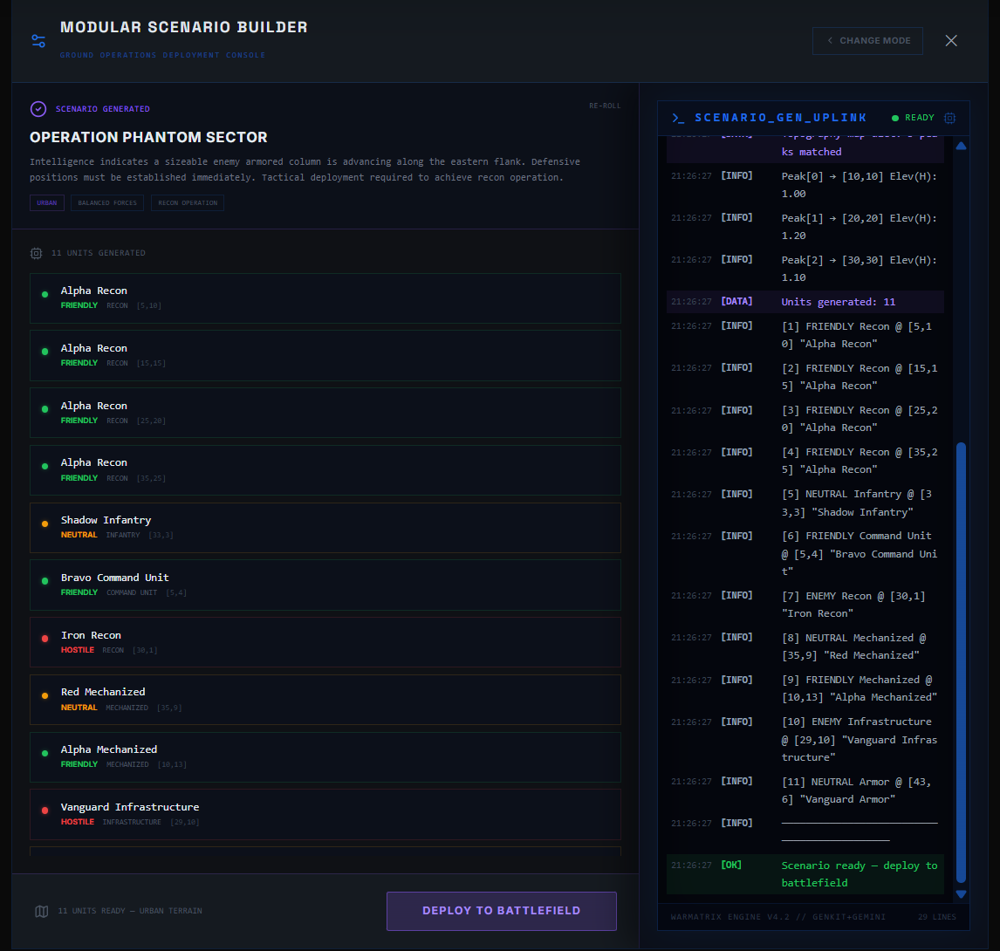
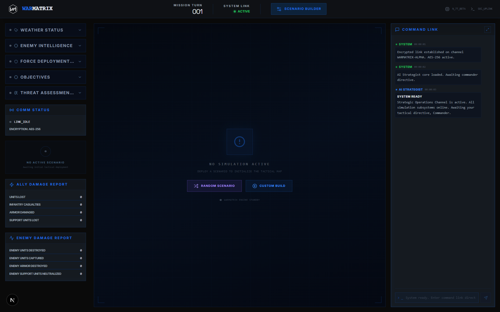
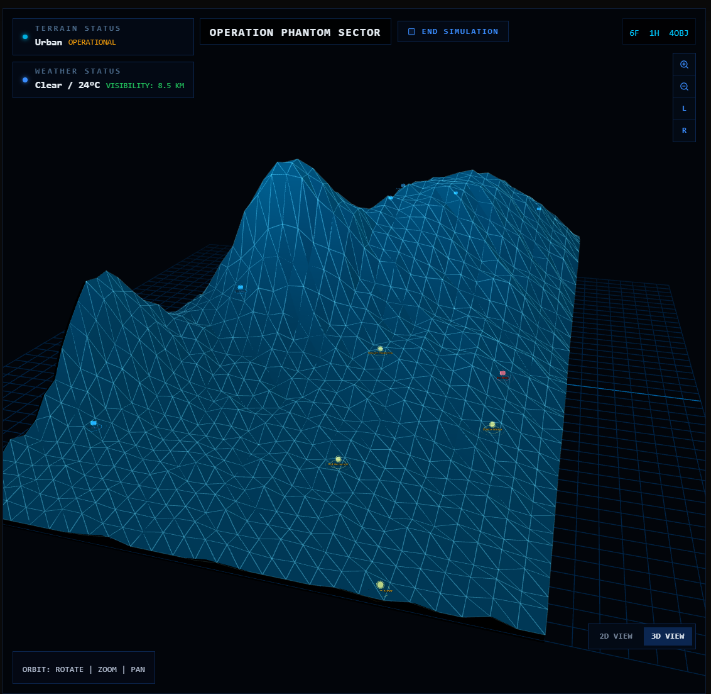
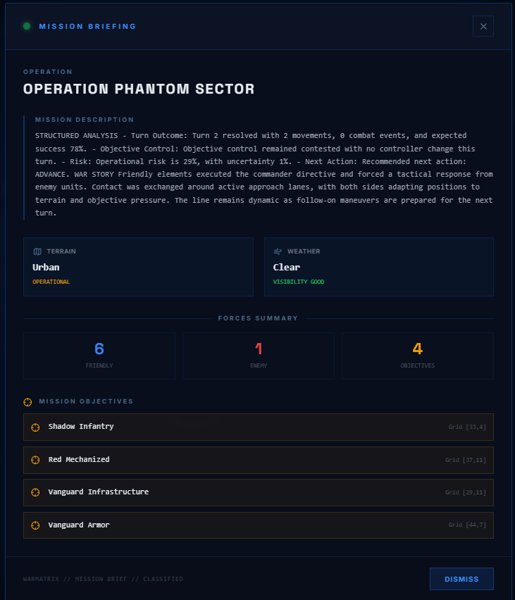
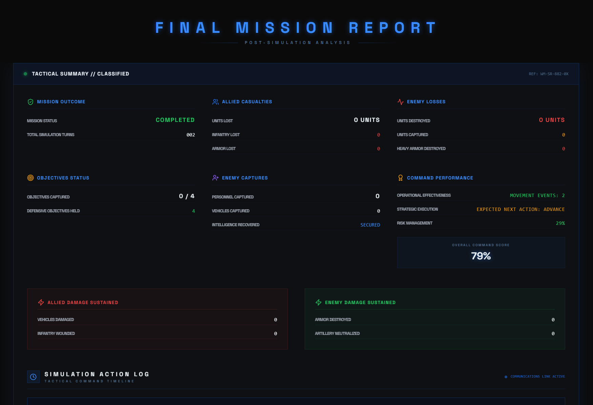

 # WarMatrix: AI-Enabled Tactical Simulation Console

[](https://opensource.org/licenses/MIT)
[](https://nextjs.org/)
[](https://fastapi.tiangolo.com/)

WarMatrix is a high-fidelity, situational awareness platform that bridges the gap between tactical simulations and modern AI analytics. Designed for immersive command experience, it provides a unified "Glass Cockpit" for operational commanders across Land, Air, and Sea domains.

---

## 🖼️ Mission Visuals

The WarMatrix interface is designed for high-density information display and tactical immersion.

| **Main Landing Page** | **Scenario Builder** | **Command Console** |
| :---: | :---: | :---: |
|  |  |  |
| **3D Tactical Map** | **Mission AI Briefing** | **Final Mission Report** |
|  |  |  |

---

## 🎖️ Operational User Perspective: A 4-Step Narrative

The WarMatrix experience follows a structured operational workflow. From the initial terminal uplink to the final after-action review, the user acts as the central Node of Intelligence.

### Step 1: Secure Terminal Uplink & Domain Entry
The user enters a **Classified Command Console** built with a dark-ops aesthetic—featuring scanline overlays and tactical grids. The "War Room" interface initializes with a secure system handshake, ensuring the user is placed into a focused, distraction-free strategic environment.

### Step 2: Intelligent Scenario Synthesis
Using the **AI Scenario Builder**, the commander defines the battlefield parameters:
- **Environmental Context:** Selection of terrain (Highlands, Urban, Desert) and real-time weather effects (Storm, Fog, Sandstorm).
- **ORBAT (Order of Battle):** Strategic deployment of friendly units and identification of enemy threats via a 3D tactical grid.
- **Strategist Briefing:** The embedded **AI Strategist** synthesizes the deployment data, providing a high-level narrative briefing and initial tactical objectives.

### Step 3: Real-Time Tactical Command Loop
Once the simulation is live, the user enters the active operational phase:
- **Visual Intelligence:** A 3D map (Three.js/Fiber) displays unit positions, movement vectors, and combat encounters.
- **Natural Language Command:** Orders are issued via the **Secure Comms Console** (e.g., *"Move 1st Battalion to the bridge and hold for reinforce"*) instead of rigid menu clicks.
- **Simulation Authority:** The backend Python engine processes each command, calculating maneuver success, combat attrition, and objective control in real-time.

### Step 4: Post-Operation Debrief (AAR)
Upon mission completion, the system transitions to a **Final Mission Report** (After-Action Review):
- **Casualty & Efficiency Analysis:** Detailed metrics on personnel losses, armor damage, and ammunition expenditure.
- **Strategic Scoring:** The AI evaluates the commander's performance, providing a narrative critique of the tactics employed and suggesting improvements for future engagements.

---

## 🛠️ Technical Architecture

### 🖥️ Frontend (Command UI)
*   **Framework:** Next.js 15 (React 19)
*   **3D Map Engine:** Three.js via `React Three Fiber` / `@react-three/drei`
*   **Styling & Components:** Tailwind CSS, Radix UI primitives, Lucide Icons
*   **Animations:** Framer Motion for smooth, tactical UI transitions
*   **State Control:** React hooks for low-latency synchronization with the simulation backend.

### ⚙️ Backend (Sim Engine)
*   **API Layer:** Python FastAPI (Uvicorn)
*   **Core Math:** Custom Python-based simulation engine (`backend/engine/`) handling pathfinding, combat probability, and state persistence.

### 🧠 AI Integration (Synthetic Strategy)
*   **Orchestration:** Firebase Genkit
*   **Intelligence:** Google Gemini (via `@genkit-ai/google-genai`)
*   **Capabilities:** Narrative generation, scenario synthesis, and strategic behavior modeling.

---

## 📂 Project Structure

- **`src/`**: Next.js frontend (App Router, Tactical Components, Hooks).
- **`backend/`**: FastAPI endpoints and core Python simulation engine.
- **`ai_server/`**: Genkit configurations and AI Flow definitions.
- **`docs/`**: Feature blueprints and design specifications.
- **`scripts/`**: Development utilities for service orchestration.

---

## 🚀 Getting Started

### 📋 Prerequisites
- **Node.js** (v20+)
- **Python** (v3.10+)

### 🔌 Installation & Execution

1.  **Dependencies:** `npm install`
2.  **Backend Environment:** Ensure you have a `.venv` in the `/backend` directory and run `pip install -r requirements.txt`.
3.  **Run Services:**
    ```bash
    # Launches both Frontend and Backend concurrently
    npm run dev
    ```

---

## 📜 License

WarMatrix is released under the **MIT License**. See [LICENSE](LICENSE) for more details.

